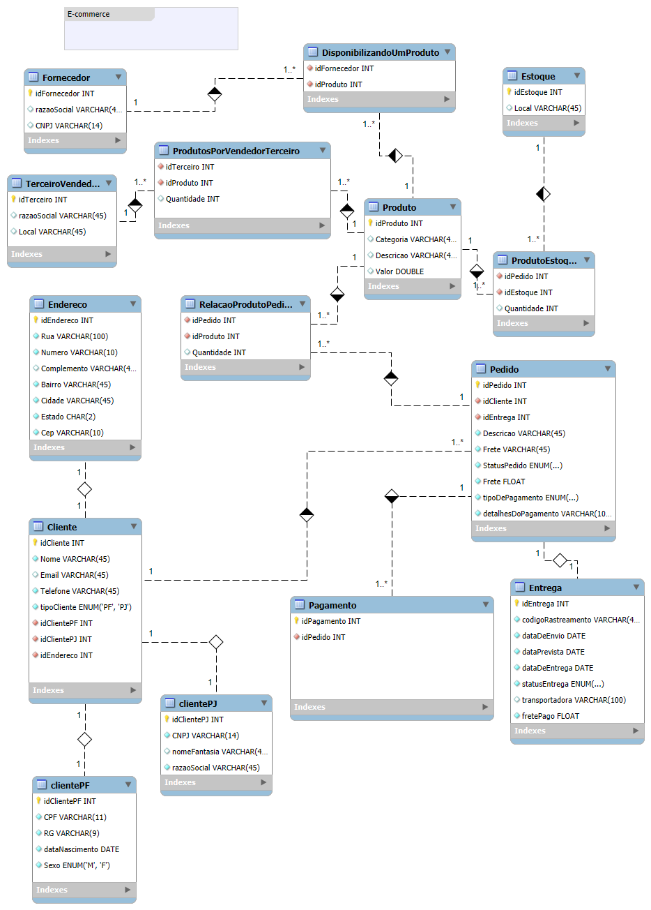

# 🛒 Refinando um Projeto Conceitual de Banco de Dados – E-COMMERCE

Este repositório apresenta o refinamento de um **Projeto Conceitual de Banco de Dados** com foco em um sistema de **E-commerce**. O objetivo é ilustrar de forma clara e eficiente a estrutura de dados necessária para suportar as principais funcionalidades de uma loja virtual, desde o cadastro de clientes até o controle de pedidos e pagamentos.

## 📌 Descrição

A proposta deste projeto é consolidar as melhores práticas de modelagem conceitual, representando todas as entidades, relacionamentos e restrições necessárias para garantir a integridade e eficiência do banco de dados.

## 🗂️ Estrutura do Repositório

- `diagrama.png`: Imagem do diagrama conceitual (DER) refinado.
- `README.md`: Este arquivo, contendo a descrição do projeto.

## 🧩 Entidades Principais

- **Cliente (PF/PJ)**
- **Produto**
- **Fornecedor**
- **Pedido**
- **Pagamento**
- **Endereço**
- **Estoque**
- **Entrega**

## 🎯 Objetivos

- Aplicar as técnicas de normalização e modelagem de dados.
- Estabelecer um modelo que facilite a implementação física no SGBD relacional.
- Criar um banco de dados que seja escalável, consistente e de fácil manutenção.
- Acrescentando os seguintes pontos:

Cliente PJ e PF – Uma conta pode ser PJ ou PF, mas não pode ter as duas informações;
Pagamento – Pode ter cadastrado mais de uma forma de pagamento;
Entrega – Possui status e código de rastreio;

## 🛠️ Tecnologias Utilizadas

- Ferramenta de modelagem: Workbench.
- Sistema Gerenciador de Banco de Dados: **MySQL**

## 📷 Preview do Projeto

## 📬 Contribuição

Fique à vontade para abrir issues ou sugerir melhorias! Este projeto é aberto para aprendizado, feedbacks e colaboração da comunidade.
